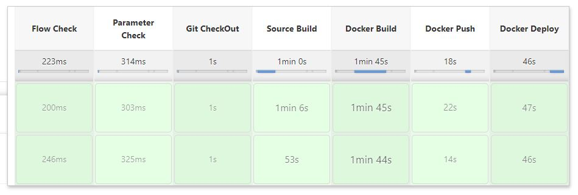

# 시작하기

## 블루 그린 배포 순서


## 블루 그린 배포 과정


1. docker bridge network 생성
```
docker network create educon_network
```

2. upload script
> blue_green_fnc.sh, run_new_was.sh, start.sh

3. Example Jenkins pipline
```
...
stage('Docker Deploy') {
    if (useDeploy) {
            sh """
            ssh -p 16215 -o StrictHostKeyChecking=no test@example.com << ENDSSH
            docker login ${ACR_SERVER} -u ${ACR_ID} -p ${ACR_PASSWORD}
            docker pull ${ACR_SERVER}/front:${BUILD_NUMBER}
            ./start.sh
ENDSSH"""
...

```

4. Jenkins pipeline deploy

